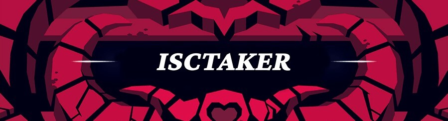
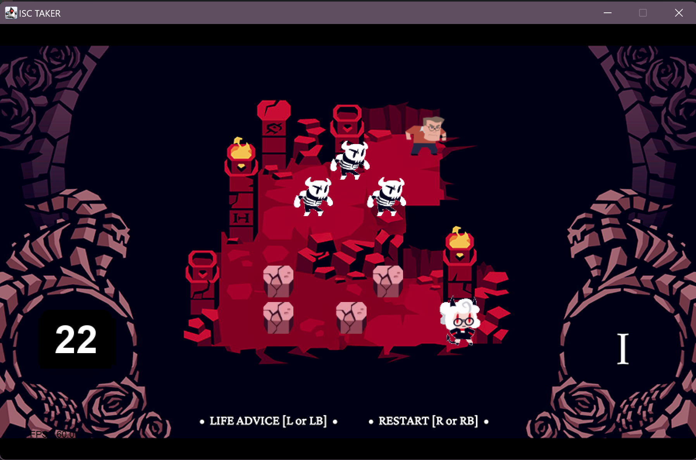
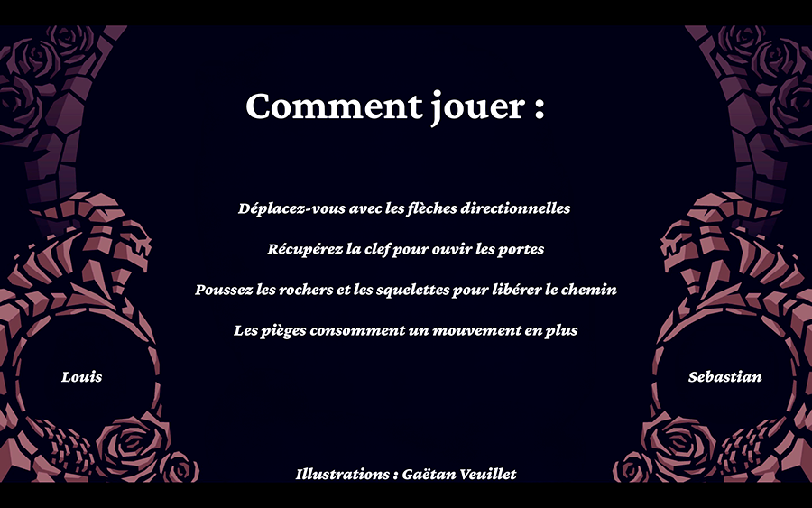

<p align="center">
  
</p>

A **Scala-based** interpretation of the original _Helltakers_ game, **ISCtaker** challenges players to navigate puzzle-like levels filled with moving obstacles, locked doors, and quirky demons. With each level growing in complexity, you'll need skill and strategy to outmaneuver skeletons, push rocks out of the way, and ultimately reach your demon companion.

<p align="center">
  
</p>

---

## Table of Contents
- [Features](#features)
- [Screenshots](#screenshots)
- [Installation](#installation)
- [How to Play](#how-to-play)
- [Entities](#entities)
- [Code Structure](#code-structure)
  - [Main.scala](#mainscala)
  - [EntityRender.scala](#entityrenderscala)
  - [Level.scala](#levelscala)
  - [Audio.scala](#audioscala)
  - [Graphics & Assets](#graphics--assets)
  - [Key Interactions](#key-interactions)
- [Contributing](#contributing)
- [Contact](#contact)

---

## Features
- **Multiple Levels**  
  Progress through increasingly challenging stages as you refine your puzzle-solving skills.
- **Unique Entities & Animations**  
  Encounter various entities—skeletons, rocks, doors, and demons—each with their own behavior and animations.
- **Interactive Transitions**  
  Enjoy seamless screen transitions and narrative interludes between levels.
- **Original Music & Sound Effects**  
  Immerse yourself in the experience with engaging background music and fitting sound effects.
- **Keyboard-Based Controls**  
  Use simple, intuitive keyboard commands to guide your character and navigate menus.

---

## Screenshots

<p float="left">
  
  
</p>

Experience the charming style and 3fps animations as you progress through each puzzle.

---

## Installation

1. **Clone the repository**:
   ```bash
   git clone https://github.com/louis272/ISCtaker.git
   ```
2. **Open in IntelliJ IDEA (or any Scala-compatible IDE)**:
   - Import the cloned repository as an existing project.
   - Ensure that you have the correct Scala SDK or JDK configurations.
     > **Tip**: We used Scala SDK 2.13.14.
3. **Run/Debug the Project**:
   - Locate the main class or run configuration in your IDE.
   - Press the run/debug button to start your journey.

> **Tip**: If you prefer using the command line, you can use [SBT (Scala Build Tool)](https://www.scala-sbt.org/) to compile and run the game.

---

## How to Play

1. **Objective**: Reach the demon in each level to progress.
2. **Movement**: Use the arrow keys to move your character across the grid.
3. **Interactions**:
   - Press **`R`** to reset the current level if you get stuck.
   - Press **`L`** to reveal hints or advice.
   - Press **`Esc`** to hide these hints.

Use your moves carefully—some obstacles can be pushed or destroyed, while others require keys to bypass.

<p align="center">
  
</p>

---

## Entities

- **Player**  
  The hero you control. Maneuver across the grid, collect items, and solve puzzles.
- **Demon**  
  Your level’s goal! Reach the demon to complete the stage and unlock new levels.
- **Skeleton**  
  A pushable obstacle that can be destroyed. Maneuver skeletons to clear paths or create new routes.
- **Rock**  
  An immovable obstacle that blocks your path but cannot be destroyed.
- **Door**  
  Pass through only after unlocking with a collected key.
- **Key**  
  A crucial item needed to unlock doors and progress further.

<p float="left">
  
  
  
  
</p>

---

## Code Structure

The **ISCtaker** project is structured to modularly handle different aspects of the game, ensuring readability, maintainability, and scalability. Here’s an overview:

### **Main.scala**
This serves as the entry point of the game, initializing the game logic, levels, and graphical components. Key functions include:
- **Game Loop**: The main loop synchronizes game logic and renders frames using `FunGraphics`.
- **Event Handling**: Captures player input to control movement, interactions, and special actions.
- **Level Management**: Handles loading, transitioning, and resetting levels, alongside rendering game elements dynamically.
- **Audio Integration**: Plays background music and sound effects corresponding to in-game events (e.g., moving objects, picking keys).

### **EntityRender.scala**
Defines the `EntityRender` class for managing graphical representations of entities:
- **Frames**: Stores paths to sprite or animation frames for dynamic rendering.
- **Scaling**: Adjusts the size of entities based on their context in the game world.

### **Level.scala**
Encapsulates the logic for individual levels, including:
- **Grid Representation**: Uses 2D arrays to define the layout of entities and traps.
- **Attributes**: Tracks maximum moves, player possession of keys, and the presence of dynamic traps.
- **Initialization**: Provides a method for setting up multiple levels with predefined configurations.

### **Audio.scala**
Handles audio playback using the Java Sound API:
- **Loading**: Reads audio files into a reusable `Clip`.
- **Playback Control**: Methods for playing, stopping, and resetting audio during gameplay.

### **Graphics & Assets**
All graphical assets (sprites, backgrounds, etc.) are referenced by their file paths and rendered using `FunGraphics`:
- **Dynamic Rendering**: Adjusts visuals based on entity state and game logic.
- **Transitions and Effects**: Includes visual transitions between levels and animations for player interactions.

### **Key Interactions**
The game logic is built around responding to player inputs and updating the game state accordingly:
- **Collision Detection**: Checks for valid moves based on the current grid state.
- **Object Interactions**: Handles pushing, destroying, and unlocking objects like rocks and doors.
- **Trap Mechanics**: Toggles the state of traps after player actions to increase challenge.

This modular structure ensures that each component can be individually tested and extended. For example, new levels or entities can be added with minimal changes to the existing codebase.

---


## Contributors

- **[@louis272](https://github.com/louis272)** – Developer
- **[@Sebastian0211-vs](https://github.com/Sebastian0211-vs)** – Developer
- **Gaëtan Veuillet** – Illustrator of all the “Mudry" Sprites

---

## Contributing

Contributions, bug reports, and feature requests are welcome! Here’s how you can help:
1. [Fork this repository](https://github.com/louis272/ISCtaker/fork).
2. Create a **branch** for your feature/bugfix:
   ```bash
   git checkout -b feature/super-cool-feature
   ```
3. Commit your changes:
   ```bash
   git commit -m "Add super cool feature"
   ```
4. **Push** to your forked repository and submit a **Pull Request**.

---

## Contact

Have questions or feedback? Feel free to reach out by creating an issue or submitting a pull request. We appreciate your interest in **ISCtaker**—thanks for playing!
